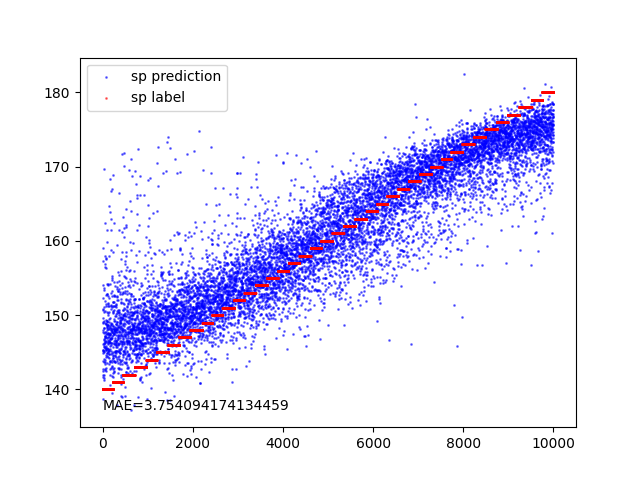

SimSCG
================

## Introduction
SimSCG predicts the systole and diastole blood pressure utilizing the sensor data. A CNN model has been developed to achieve this purpose and is saved to `cnn_model.h5`. Respective datasets are available in `/data` folder.

## How to run?
```sh
pip3 install requirements.txt
python3 main_plot.py
```

## Results
True and predicted systole and diastole blood pressure labels get plotted and saved to `sp.png` and `dp.png` respectively.

